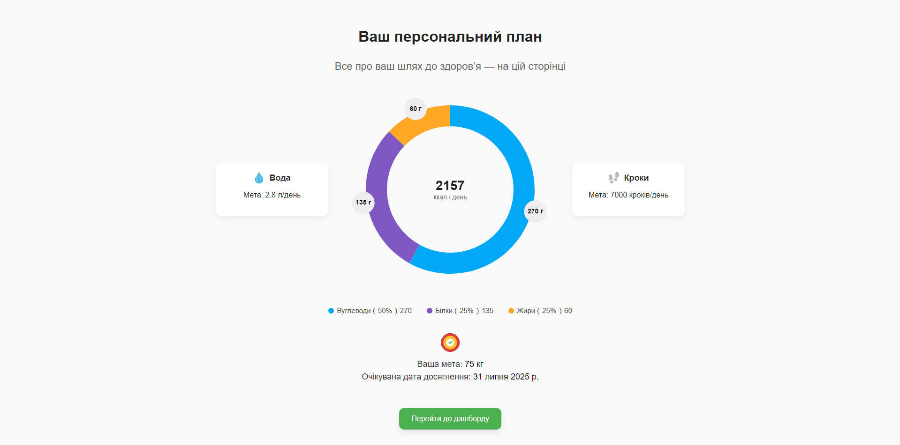
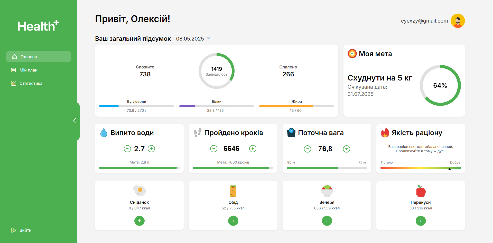
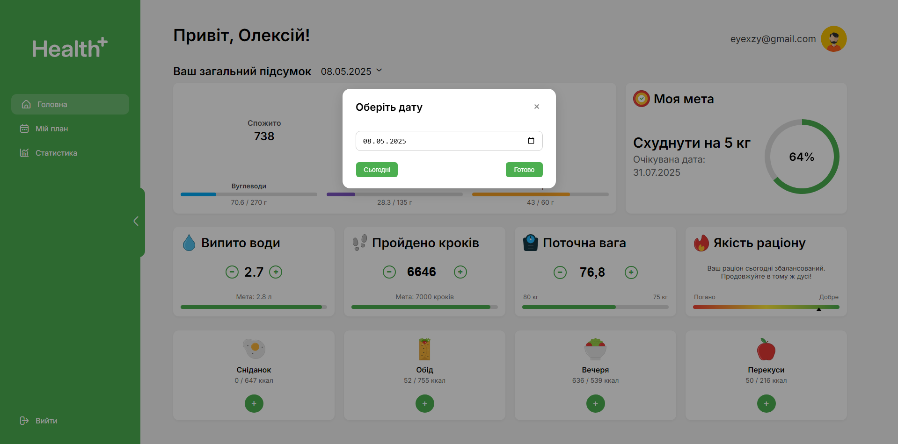
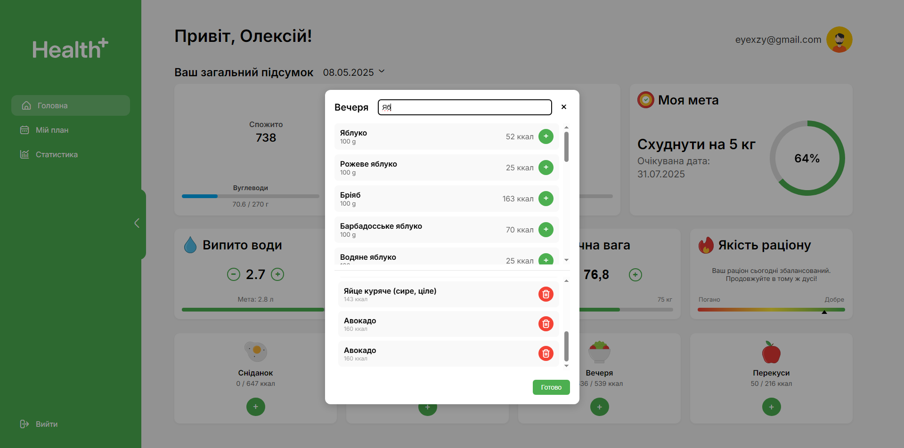

# Health Plus

Health Plus — це простий інтерактивний застосунок, як інструмент для відстеження показників здоров’я і параметрів тіла, подолання дефіциту чи профіциту ваги. Користувач зможе моніторити свій прогрес та коригувати значення показників. Застосунок зосереджений на базовому функціоналі без перевантаження інтерфейсу, орієнтований на щоденну взаємодію без вбудованої реклами, забезпечує підтримку української мови, містить у базі даних продукти виготовлені в Україні, і має доступ до всіх можливостей без платних обмежень.

---

## Підготовка середовища

- Встановити Node.js (версія LTS): https://nodejs.org/
- Зареєструватися в MongoDB Atlas: https://www.mongodb.com/products/platform/atlas-database

---

## Клонування репозиторію

```bash
git clone https://github.com/Pilmik/health-project.git
cd health-project
```

---

## Структура проєкту

```
health-project/
├── client/         # Папка для frontend (HTML, CSS, JS)
├── server/         # Папка для backend (Node.js + Express)
├── app.js          # Головний файл сервера, що запускає застосунок, налаштовує маршрути й middleware
└── .env            # Файл конфігурації середовища

```

---

## Встановлення залежностей

```bash
npm install
```

---

## .env

Підготуйте файл конфігурації змінних середовища:

```bash
touch .env
```

Приклад вмісту:

```env
PORT=5000
MONGO_URL=your_mongodb_connection_string
JWT_SECRET=your_jwt_secret_key
```
> JWT_SECRET - будь-який, наприклад: qwerty1234
---

## Запуск сервера

Для запуску app.js виконайте в терміналі:

```bash
npm start
```
---

## Запуск фронтенду через Live Server

Щоб запустити клієнтську частину застосунку:

1. Встановіть розширення **Live Server** у Visual Studio Code:
   - Відкрийте VS Code
   - Перейдіть у Extensions (`Ctrl+Shift+X`)
   - Знайдіть *Live Server* та натисніть **Install**

2. Натисніть правою кнопкою миші по файлу `client/login.html` і з випадного меню оберіть **Open with Live Server** 

---

## Налаштування MongoDB

1. Перейдіть на [MongoDB Atlas](https://www.mongodb.com/cloud/atlas)
2. Зареєструйтесь або увійдіть через Google
3. Створіть новий проект (наприклад, health-project)
4. Натисніть "Create Cluster" (Tier 0 - безкоштовний, AWS або Azure)
5. Дочекайтесь створення (1–2 хвилини)
6. У `Database Access` натисніть “Add New Database User”:
   - Введіть логін і пароль
   - Роль: `Read and write to any database`
7. У `Network Access` → “Add IP Address”:
   - або `Allow access from anywhere`, або введіть свою IP
8. У `Clusters` → “Connect” → “Connect your application”
9. Скопіюйте `mongodb+srv://...` рядок і вставте його в `.env` у MONGO_URL

---

## Інструкція користувача (User Manual)

### Реєстрація

Переходьте на `register.html`, щоб створити обліковий запис. Користувач проходить багатокрокову форму реєстрації з валідацією на кожному етапі:

1. Введіть ім’я
2. Виберіть дату народження (підтримується тільки вік 13–110 років)
3. Укажіть свою вагу (30–300 кг) та зріст (100–250 см)
4. Оберіть стать
5. Вкажіть кількість прийомів їжі (1–7)
6. Оберіть стиль життя:
   - Сидячий
   - Помірно активний
   - Активний
7. Оберіть ціль: **схуднення** або **набір ваги**
8. Вкажіть скільки кілограмів хочете змінити
9. Задайте щоденну ціль по калоріях (100–1200 для схуднення, до 10000 для набору)
10. Введіть email та надійний пароль:
    - ≥ 8 символів
    - великі/малі літери
    - цифри й спецсимволи
11. Підтвердіть пароль

> Якщо вага вже в межах норми, зʼявляється попередження та чекбокс на підтвердження наміру. Якщо ціль виходить за межі норми — продовження заборонене.

---

### Персоналізований план



Після реєстрації:
- система автоматично розраховує індивідуальний план (BMR, TDEE);
- встановлює цілі по калоріях, макроелементах, воді, кроках;
- прогнозує дату досягнення цілі;
- все зберігається в MongoDB;

---

### Головна сторінка дашборду



Доступна після входу. Ви побачите:

- Привітання + ім’я та email
- Загальний підсумок дня
- Прогрес по:
  - калоріях (макроелементи БЖВ)
  - кроках (з метою)
  - воді (літри + ціль)
  - вазі (візуальна шкала від старту до мети)
- 4 блоки прийомів їжі: **сніданок**, **обід**, **вечеря**, **перекуси**
- Якість раціону (оцінюється автоматично на основі healthScore продуктів)
- Ліва навігаційна панель на якій можна перейти до перегляду вашого плану і статистики

> Усі дані зберігаються окремо для кожного дня.

---

### Вибір дати



- Над заголовком підсумку можна обрати дату (натискання відкриває календар)
- Кнопка **“Сьогодні”** повертає до поточної дати
- Після вибору дати:
  - завантажується вода, кроки, вага, їжа, статистика;
  - можна змінити показники обраного дня.

---

### Додавання їжі



- Натисніть "+" у потрібному прийомі (наприклад, обід)
- Зʼявиться вікно пошуку продуктів з бази
- Продукти українського ринку також включені
- Після додавання:
  - оновлюються макроелементи (БЖВ)
  - оновлюється загальна калорійність
  - якість раціону перераховується
- Можна видалити продукт зі списку

---

### Статистика


На вкладці **“Статистика”** — інтерактивна аналітика:

- Обирайте **тиждень** або **місяць**
- Відображаються графіки:
  - Споживання води
  - Кроки
  - Зміна ваги
  - Калорії
  - Якість раціону
  - Енергетичний баланс (спожито / спалено)
  - Співвідношення БЖВ
  - Часто вживані продукти

> Усі графіки формуються на основі щоденних записів користувача з MongoDB.

---

### Вхід / Вихід

- Для входу відкрийте `login.html`
- Введіть email і пароль
- Пароль можна показати або приховати (іконка ока)
- Якщо все правильно — автоматичне перенаправлення на дашборд
- При виході (натискання “Вийти”):
  - видаляється токен
  - відбувається вихід на сторінку входу

---

## Команда

**Health Plus, НаУКМА 2025**  
- Молчанов Олексій  
- Пілат Михайло  
- Пілат Єва
